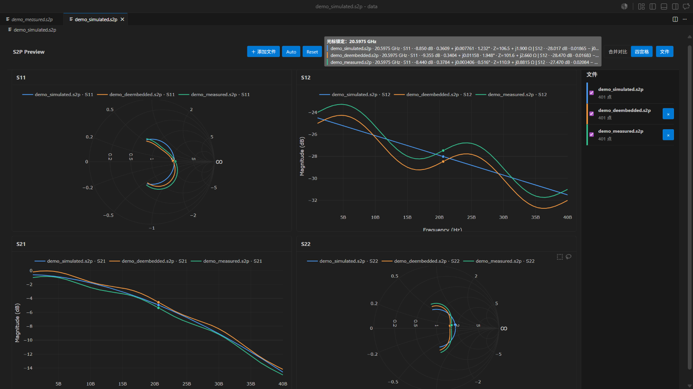
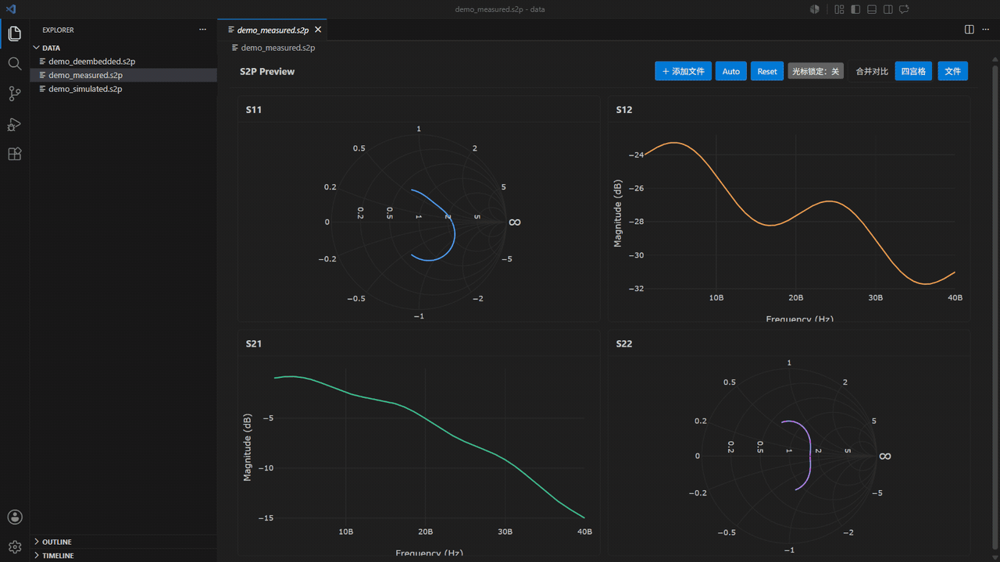

# S2P Viewer

[](https://github.com/really12138/s2p-viewer-vscode/actions/workflows/ci.yml)
[](LICENSE)

[English](README.md)

点击 `.s2p` 文件，即可在 VS Code 中查看二端口 S 参数。插件可对比 2–10 份
相关测量或仿真结果，数据全程留在本地，无需离开编辑器。



## 主要功能

- 以只读自定义编辑器自动打开 `.s2p` 和 `.S2P` 文件。
- S11/S22 使用 Smith Chart，S12/S21 使用幅度 dB 图。
- 可在合并对比与 S 矩阵四宫格之间切换。
- 支持 2–10 文件对比，并提供独立颜色、显隐、移除和错误状态。
- 悬停或锁定指针后，各文件会吸附到最近真实频点，同时显示复数、相位、dB
  以及反射参数阻抗读数。

适合比较测量与仿真、原始与去嵌结果，或其他相关二端口文件。



## 安装

从 [v0.1.0 Release 下载 `s2p-viewer-0.1.0.vsix`](https://github.com/really12138/s2p-viewer-vscode/releases/tag/v0.1.0)，
然后执行：

```powershell
code --install-extension ".\s2p-viewer-0.1.0.vsix" --force
```

需要 VS Code 1.123 或更高版本。从源码构建请参阅
[CONTRIBUTING.md](CONTRIBUTING.md)。

## 使用方法

1. 在 Explorer 中点击 `.s2p`，**S2P Preview** 会自动打开。
2. 通过工具栏添加文件；也可以在 Explorer 中多选 `.s2p`，右键选择
   **Compare S2P Files**。
3. 将鼠标悬停在曲线上查看最近频点；单击锁定同步指针，再次单击或按
   `Escape` 解锁。

如需查看原始 Touchstone 文本，请使用 **Reopen Editor With → Text Editor**。
**Auto** 自动缩放，**Reset** 恢复坐标范围，**File** 打开对比文件控制面板。

## 支持格式

- Touchstone 1.x、2.0、2.1 二端口 S 参数
- `Hz`、`kHz`、`MHz`、`GHz`；`RI`、`MA`、`DB`
- Touchstone 2.x full、lower、upper 矩阵
- 全局或逐端口参考阻抗
- UTF-8/ASCII、注释、换行记录和科学计数法

噪声段可以被识别，但不会绘图。格式错误或暂不支持的输入会显示结构化诊断，
不会遮蔽其他有效对比文件。

## 隐私与当前限制

S2P Viewer 只读并完全在本地运行，不包含遥测、CDN、网络服务、本地服务器，
也不依赖 Python 或 MATLAB。请勿在公开 Issue 中上传专有测量或 PDK 数据，
建议使用合成样例复现问题。

0.1.0 不支持编辑、去嵌、校准、网络参数转换、无源性/因果性分析、噪声绘图、
数据导出或非二端口 `.sNp` 文件；一次最多对比十个文件。

## 项目资料

[贡献指南](CONTRIBUTING.md) · [安全说明](SECURITY.md) ·
[架构](docs/architecture.md) · [更新记录](CHANGELOG.md) ·
[第三方声明](THIRD_PARTY_NOTICES.md)

## 许可证

S2P Viewer 基于 [MIT License](LICENSE) 发布。
