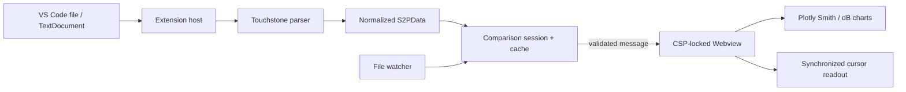

# Architecture

S2P Viewer separates local file access from untrusted rendering content. The
extension host owns every URI, read, parse, cache, comparison session, and file
watcher. The Webview receives only normalized values through validated message
contracts and renders them with a bundled Plotly build.

## Extension host

- `CustomTextEditorProvider` registers the default read-only `.s2p` editor and
  creates the Webview boundary.
- `FileLoader` reads through VS Code's filesystem API and parses outside the
  Webview.
- `ComparisonSession` preserves one primary plus up to nine comparison files,
  assigns stable colors, and isolates per-file failures.
- `ParsedFileCache` coalesces concurrent reads and invalidates generations on
  text or external file changes.
- `FileChangeController` debounces watcher events and prevents stale async
  completions from replacing newer content.
- `PreviewInstrumentation` is reachable only in VS Code test mode.

## Touchstone and RF core

The parser tokenizes comments/options/keywords, dispatches to strict 1.x or
2.x processing, validates exactly two-port S-parameter matrices, and normalizes
frequency, reference impedance, and complex arrays. RF conversion and nearest
frequency selection are pure modules with no VS Code or DOM dependency.

Different files keep their original frequency grids. Cursor synchronization
uses the nearest real sample in each visible file and reports out-of-range data
instead of interpolating or extrapolating it.

## Webview

The Webview state reducer owns layout and visible-file state. A render scheduler
coalesces updates, while Plotly render and cursor operations use generation
fences so stale promises cannot overwrite newer plots or metrics. Reflection
parameters use `scattersmith`; transmission parameters use `scatter` dB traces.

The generated HTML uses a nonce-based CSP. Scripts, styles, and fonts are local;
there is no CDN or network runtime. Text is assigned through DOM APIs rather
than concatenated into HTML. Both directions of the message bridge validate
exact discriminated payloads.

## Packaging and verification

esbuild produces the extension, Webview, style, test, benchmark, and VSIX
normalization bundles. `.vscodeignore` limits the VSIX to production bundles,
public documentation, license, notices, and manifest. The final archive is
normalized with stable entry order, timestamps, attributes, and compression so
identical source produces an identical SHA-256.

The automated tag workflow runs TypeScript checking, Vitest unit/Webview tests,
a real VS Code 1.123.0 Electron suite, deterministic packaging, checksum
generation, and GitHub Release creation. For v0.1.0, package inspection,
byte-for-byte double packaging, and the representative-data benchmark are
manual release-candidate checks.
